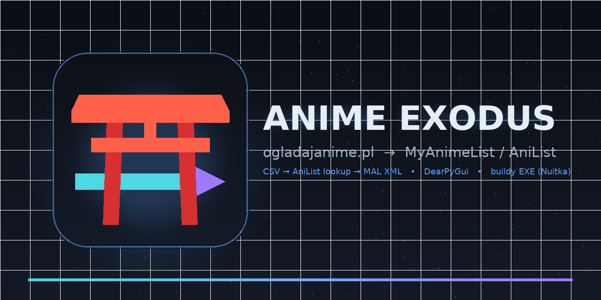
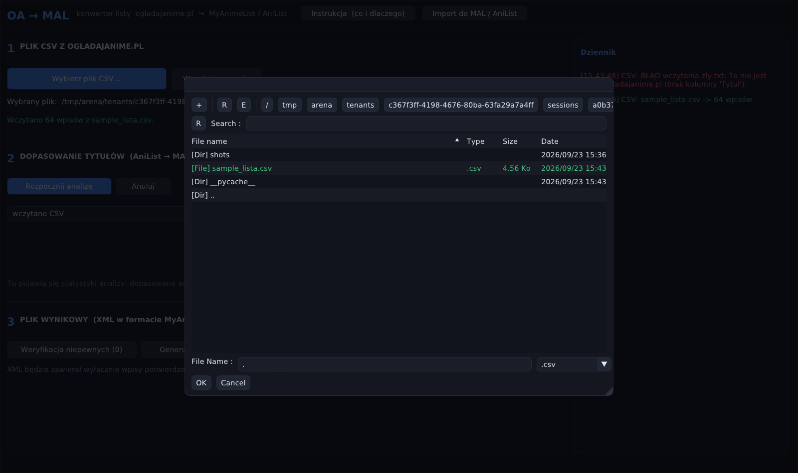
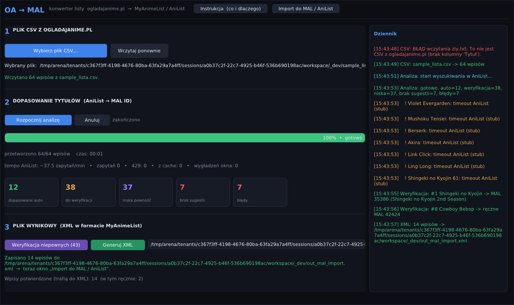
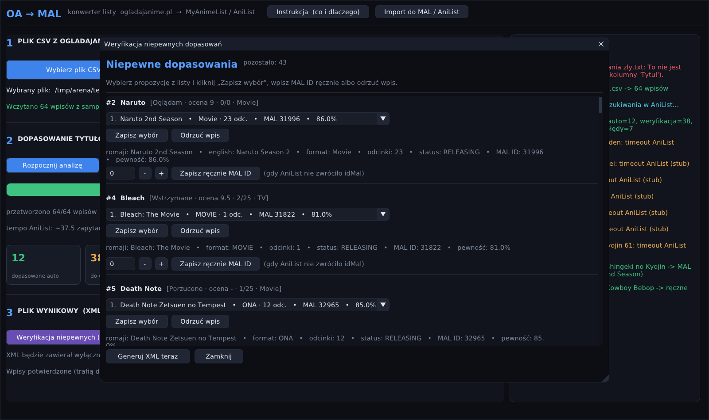
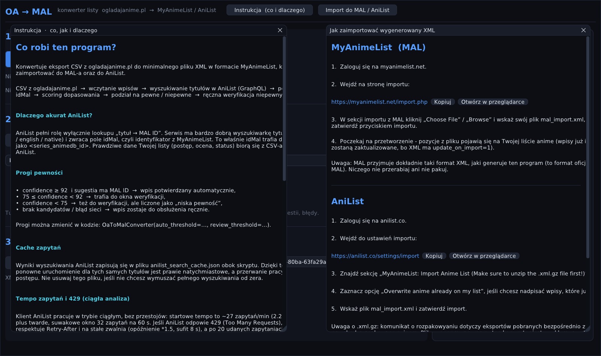
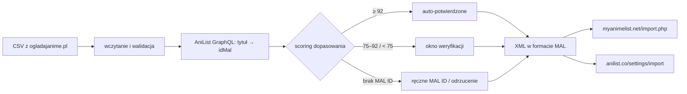

<div align="center">



# ANIME EXODUS
### Eksodus Twojej listy anime z ogladajanime.pl do MyAnimeList i AniList

[](https://github.com/karnyjohnny/anime-exodus/actions/workflows/build.yml)
[](https://github.com/karnyjohnny/anime-exodus/releases/latest)
[](https://www.python.org/)
[](https://github.com/hoffstadt/DearPyGui)
[](https://nuitka.net/)
[](LICENSE)

**CSV z ogladajanime.pl → dopasowanie tytułów w AniList → gotowy XML do importu w MAL / AniList.**
Ciemne GUI DearPyGui, ciągła analiza bez stop-and-go, gotowe buildy `.exe` w Releases.

</div>

---

## Czym jest ogladajanime.pl?

> Oglądaj Anime to jedna z najpopularniejszych w Polsce nieoficjalnych platform
> streamingowych poświęconych japońskiej animacji. Umożliwia bezpłatne oglądanie
> seriali i filmów anime z polskimi napisami.

Lata oglądania = długa lista tytułów. Kiedy chcesz przenieść ją do
**MyAnimeList** albo **AniList**, ręczne klepanie setek pozycji boli.
**Anime Exodus** robi to za Ciebie: czyta eksport CSV, sam znajduje każde anime
w bazie AniList (skąd bierze oficjalne MAL ID) i składa plik XML gotowy do
importu po obu stronach.

## Co potrafi

- wczytuje eksport CSV z ogladajanime.pl (walidacja + lista błędów parsowania),
- dopasowuje tytuły przez **AniList GraphQL** (romaji / english / native) i pobiera `idMal`,
- scoring z progami: auto-potwierdzenie ≥ 92, weryfikacja 75–92, niska pewność < 75,
- okno **ręcznej weryfikacji**: dropdown z propozycjami, podgląd szczegółów,
  ręczne MAL ID, odrzucanie wpisu,
- **ciągła analiza mimo limitów API**: adaptacyjny rate-limit (AIMD), suwakowe okno
  zapytań/min, respektowanie `Retry-After`, anulowanie działające nawet w trakcie pauzy,
- cache zapytań (`anilist_search_cache.json`) — ponowny start jest prawie natychmiastowy,
- generuje minimalny, przetestowany XML w formacie eksportu MyAnimeList,
- wbudowana instrukcja: „co i dlaczego" oraz „jak zaimportować do MAL / AniList",
- nowoczesny dark mode, pełny ekran, responsywny layout, dziennik zdarzeń.

## Zrzuty ekranu

| Wybór pliku (File & Directory Selector) | Okno główne: progress + statystyki |
|---|---|
|  |  |

| Weryfikacja niepewnych | Start aplikacji |
|---|---|
|  |  |

## Jak to działa



AniList pełni rolę wyłącznie lookupu `tytuł → MAL ID`. Prawdziwe dane Twojej listy
(postęp, ocena, status) pochodzą z CSV i trafiają do `<my_watched_episodes>`,
`<my_score>` i `<my_status>`.

## Szybki start (z kodu źródłowego)

```bash
git clone https://github.com/karnyjohnny/anime-exodus.git
cd anime-exodus
python -m venv .venv && .venv\Scripts\activate   # Linux/macOS: source .venv/bin/activate
pip install -r requirements.txt
python oa_gui.py
```

Wymagania: Python 3.11+, `dearpygui 2.3.1`, `requests`, `rapidfuzz` (lepszy scoring).

## Gotowe EXE (bez Pythona)

1. Wejdź w [Releases](https://github.com/karnyjohnny/anime-exodus/releases/latest).
2. Pobierz `AnimeExodus-Windows-x64.exe` (albo build Linux/macOS).
3. Uruchom — to pojedynczy plik, niczego nie instaluje.

> Windows może ostrzec SmartScreenem (plik nie jest podpisany cyfrowo):
> kliknij **„Więcej informacji” → „Mimo to uruchom”**. To normalne dla
> niezależnych buildów.

Buildy powstają automatycznie w GitHub Actions przy każdym tagu `v*`
(Nuitka-Action → standalone EXE / bin / .app).

## Zbuduj EXE samodzielnie

### Lokalnie (Nuitka)

```bash
pip install -r requirements.txt nuitka
python -m nuitka --mode=onefile ^
  --windows-console-mode=disable ^
  --include-package-data=certifi ^
  --windows-icon-from-ico=assets/icon.ico ^
  --output-dir=dist oa_gui.py
```

(Linux/macOS: zamiast `^` użyj `\`.) Wynik: `dist/oa_gui.exe`.

### CI (GitHub Actions)

Workflow `.github/workflows/build.yml`:

- trigger: push taga `v*` **lub** ręczny *Run workflow*,
- matrix: `windows-latest` (onefile `.exe`), `ubuntu-latest` (onefile `.bin`),
  `macos-latest` (bundle `.app` w zipie),
- krok `Nuitka/Nuitka-Action@main` kompiluje `oa_gui.py` (GUI bez konsoli,
  ikona, metadane wersji, cache ekstrakcji onefile),
- artefakty trafiają do zakładki **Artifacts** każdego przebiegu,
- przy tagu dodatkowo job `release` publikuje wszystko w **GitHub Releases**.

Nowe wydanie = nowy tag:

```bash
git tag v1.2.0
git push origin v1.2.0
```

## Import do MAL i AniList

**MyAnimeList:** zaloguj się → [myanimelist.net/import.php](https://myanimelist.net/import.php)
→ „Choose File” → wskaż `mal_import.xml` → zatwierdź import.

**AniList:** zaloguj się → [anilist.co/settings/import](https://anilist.co/settings/import)
→ sekcja *„MyAnimeList: Import Anime List (Make sure to unzip the .xml.gz file first!)”*
→ opcjonalnie zaznacz *„Overwrite anime already on my list”* → wskaż `mal_import.xml`.

Nasz plik jest **czystym XML-em** (nie `.xml.gz`), więc niczego nie rozpakowujesz.

## FAQ

- **Dlaczego analiza zwalnia po 429?** Klient AniList celowo jedzie wolniej
  (~27 zapytań/min) i po każdym 429 trwale zwalnia (AIMD), żeby analiza szła
  *ciągle*, a nie burstami z przestojami. Tempo i licznik 429 widać pod progresem.
- **Czy mogę zmienić tempo?** Tak: `CONVERTER_KWARGS` na górze `oa_gui.py`
  (np. `{"request_delay": 1.5, "max_requests_per_minute": 40}`).
- **Gdzie są logi z EXE?** Obok pliku: `oa_gui.err.txt` / `oa_gui.out.txt`.
- **Ponowna analiza czyści ręczne potwierdzenia** — GUI pyta przed startem.
- **Cache** (`anilist_search_cache.json`) przyspiesza ponowne starty — nie usuwaj.

## Struktura repo

```
anime-exodus/
├── oa_gui.py                  # GUI (DearPyGui 2.x)
├── oa_converter.py            # klasa OaToMalConverter + klient AniList
├── requirements.txt
├── README.md
├── LICENSE
├── .github/workflows/build.yml# CI: Nuitka → EXE/bin/app + Releases
├── assets/                    # banner, ikona, zrzuty ekranu
│   └── screenshots/
├── tools/make_art.py          # regeneracja ikony i banneru (Pillow)
└── README_GUI.md              # dokumentacja developerska + testy headless
```

## Zastrzeżenie

Projekt nie jest powiązany z ogladajanime.pl, MyAnimeList ani AniList.
Używaj go z szacunkiem dla limitów API i regulaminów serwisów.

## Licencja

MIT © 2026 karnyjohnny — patrz [LICENSE](LICENSE).
